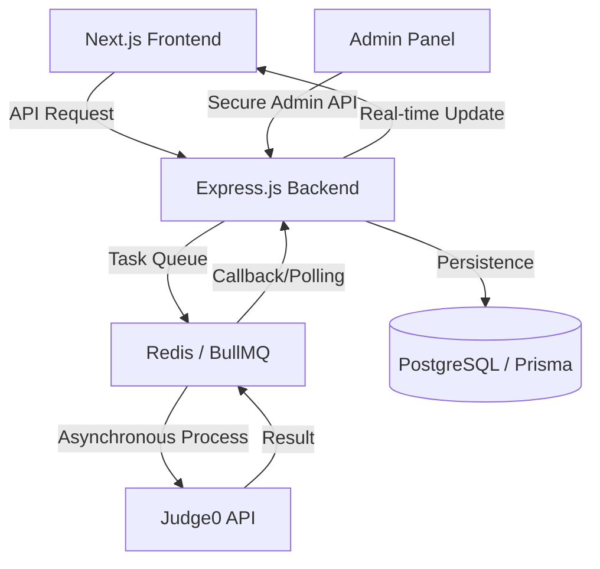

# VintiCode 🚀

### _The Ultimate High-Performance Coding Platform_

**VintiCode** is a premium, open-source Online Judge platform designed for developers to practice algorithmic challenges. Built with a focus on engineering excellence, it showcases a scalable, asynchronous architecture capable of handling high-concurrency code submissions with precision and speed.

---

## 💼 For Recruiters & Engineering Managers

_A 1-minute summary of why this project matters._

**VintiCode** demonstrates the transition from a simple "LeetCode clone" to a professional full-stack application by solving complex problems like **secure, non-blocking code execution at scale** and **enterprise-grade administrative control**.

### Core Competencies Demonstrated:

- **Asynchronous System Design:** Implemented task queues using **BullMQ** and **Redis** to ensure compute-heavy tasks never block the user interface.
- **Full-Stack Admin Suite:** Built a comprehensive, secure administrative panel for real-time platform management and analytics.
- **Architectural Excellence:** Refactored from a feature-based structure to a modular **Controller/Router pattern** for enterprise-grade maintainability.
- **Security-First Approach:** Abstracted code execution to a secure **Judge0** sandbox and implemented multi-tier JWT authentication (User & Admin).
- **Premium UX/UI:** Delivered a world-class developer experience using **Monaco Editor**, **Framer Motion**, and a professional **Monochrome Admin Aesthetic**.

---

## 🛠️ The Admin Powerhouse

VintiCode includes a production-grade **Admin Dashboard** designed for platform operators to manage the ecosystem with ease.

- **Monochrome Design System:** A sleek, high-contrast black-and-white interface built for focus and clarity.
- **Platform Analytics:** Real-time metrics on user growth, submission volume, and platform performance.
- **Question & Test Case Management:** Complete CRUD operations for coding challenges, including a secure system for handling hidden test cases.
- **User & Submission Oversight:** Detailed views of user profiles, performance tracking, and granular submission history.
- **Secure Admin Auth:** Dedicated JWT-based authentication layer protecting administrative routes.

---

## ✨ Key Features

- **Interactive Code Editor:** Monaco Editor integration with multi-language support and custom themes.
- **Real-time Submission System:** Powered by BullMQ and Redis for efficient, asynchronous task processing.
- **Comprehensive Dashboards:** Tailored experiences for both users (practice tracking) and admins (platform control).
- **Premium UI/UX:** Built with Next.js 15, HeroUI, and Framer Motion for a fluid, glassmorphic user design and a professional admin aesthetic.
- **Scalable Backend:** Express.js architecture with organized Controller/Route patterns and Prisma ORM for PostgreSQL.

---

## 🏗️ System Architecture & Data Flow

VintiCode uses a decoupled, event-driven architecture to handle submissions without latency.



---

## 🛠️ Tech Stack

### Frontend & UI
- **Core:** Next.js 15+ (App Router), TypeScript, React 19
- **Design:** HeroUI, Tailwind CSS, Lucide Icons
- **Animations:** Framer Motion, GSAP
- **Editor:** @monaco-editor/react

### Backend & Infrastructure
- **Core:** Node.js, Express.js (Controller/Router Pattern)
- **Database:** PostgreSQL with Prisma ORM
- **Concurrency:** Redis & BullMQ
- **Sandbox:** Judge0 integration via RapidAPI
- **Auth:** Multi-tier JWT (User & Admin)

---

## 🚀 Getting Started

### Prerequisites
- Node.js (v18+)
- PostgreSQL & Redis
- RapidAPI Key (for Judge0)

### Installation & Setup

1. **Clone the repository:**
   ```bash
   git clone https://github.com/yatinsingh2007/VintiCode.git
   cd VintiCode
   ```

2. **Backend Setup:**
   ```bash
   cd allgrow-backend
   npm install
   # Configure your .env (DATABASE_URL, REDIS_URL, JWT_SECRET, ADMIN_JWT_SECRET)
   npx prisma generate && npx prisma migrate dev
   npm run dev
   ```

3. **Frontend Setup:**
   ```bash
   cd ../vinticode-frontend
   npm install
   # Configure your .env (NEXT_PUBLIC_BACKEND_URL)
   npm run dev
   ```

---

## 📂 Project Structure

```text
VintiCode/
├── allgrow-backend/       # Express.js API
│   ├── controllers/      # Business Logic (Auth, Admin, Dashboard, Submissions)
│   ├── routes/           # Route Definitions (Clean separation)
│   ├── prisma/           # Database Schema & Client
│   └── middleware/       # JWT Auth (User & Admin tiers)
└── vinticode-frontend/    # Next.js Application
    ├── app/               # Next.js App Router
    │   ├── (user)/       # User-facing platform pages
    │   └── admin/        # Monochrome Admin Suite
    ├── components/        # Reusable UI Components
    └── lib/               # API utilities and Auth hooks
```

---

## 📄 License

Distributed under the ISC License. See `LICENSE` for more information.

---

Built with ❤️ by [Yatin Singh](https://github.com/yatinsingh2007)
