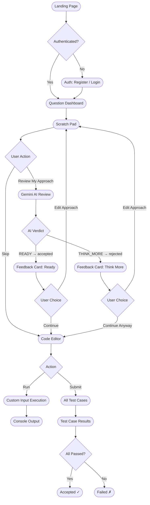
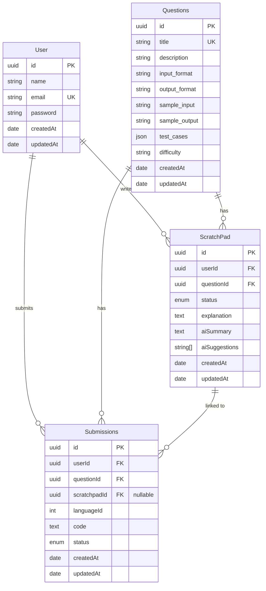
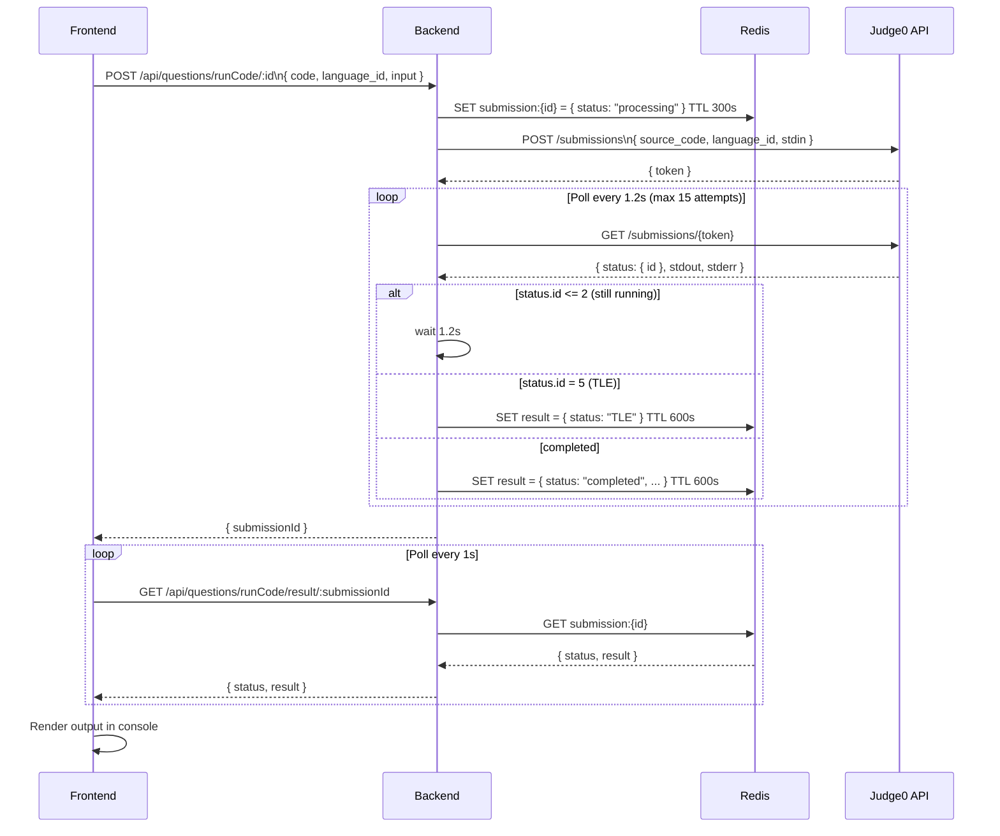
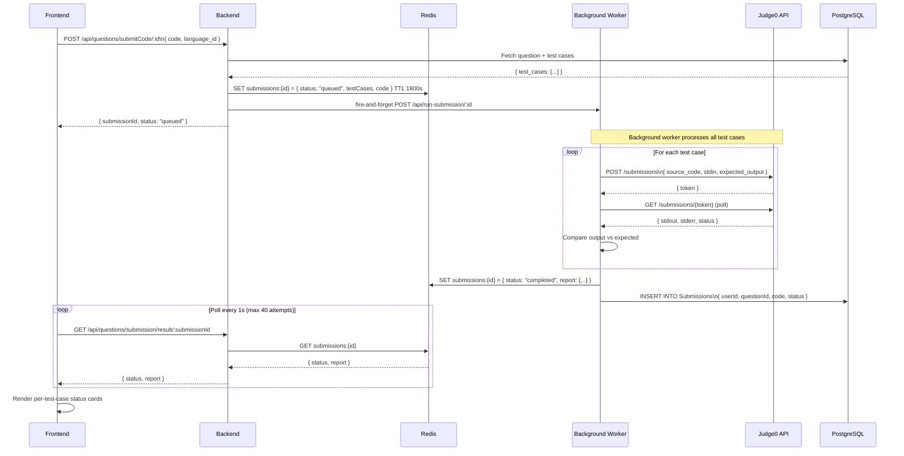
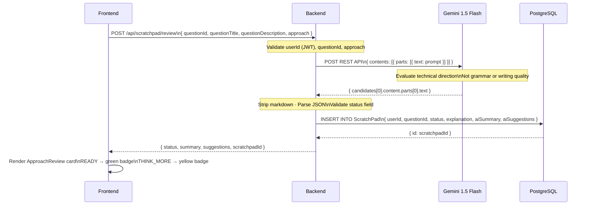

# VintiCode

### _Practice the complete interview workflow — not just the code._

**VintiCode** is a full-stack coding practice platform built to simulate how software engineers actually prepare for technical interviews. Most platforms drop you directly into an editor. VintiCode encourages the full workflow: read the problem, plan your approach, get AI feedback on your thinking, then write the code.

---

## Why VintiCode is Different

Every other platform starts at the editor. VintiCode starts one step earlier.

Before a user writes a single line of code, they are guided through a **Scratch Pad** — a private planning space where they can write pseudocode, notes, and ideas. An optional **AI Approach Review**, powered by Gemini 1.5 Flash, then evaluates whether they have enough understanding to begin implementing.

The AI behaves like a supportive mentor, not a gatekeeper. It never blocks the user from coding. It simply asks: _"Have you thought about this enough to start?"_

This reinforces habits that matter in real interviews:

- Reading the problem carefully
- Planning before coding
- Thinking about edge cases and complexity
- Explaining your thinking

---

## Feature Overview

### Landing Page
- Animated welcome screen with typing effects and background animations
- Auto-redirects authenticated users directly to their dashboard

### Authentication
- Register and login with email and password
- Secure JWT-based sessions stored in `httpOnly` cookies
- 7-day session persistence with automatic 401 redirects

### Question Dashboard
- List of all available coding challenges with difficulty badges
- Visual indicator showing which questions have already been solved

### Scratch Pad (Pre-Coding Planning)
- Private Monaco Editor workspace before every question
- Completely optional — users can skip at any time
- Character counter, dark/light theme support

### AI Approach Review
- Triggered by "Review My Approach" inside the Scratch Pad
- Calls **Gemini 1.5 Flash** via direct REST API
- Evaluates technical understanding, not writing quality or English fluency
- Returns one of two verdicts:
  - **Ready to Start Coding** — the user has enough direction
  - **Consider Thinking a Bit More** — the approach needs more planning
- Includes an encouraging summary and up to 3 gentle hints
- Never reveals the algorithm or solves the problem
- Full review (user notes + AI verdict + AI summary + suggestions) saved to the database
- User can always continue to coding regardless of the verdict

### Code Editor
- Monaco Editor with syntax highlighting
- Language support: **Python**, **C++**, **Java**, **JavaScript**
- Font size selector, dark/light themes
- Resizable split-panel layout (problem statement / editor / console)

### Code Execution
- **Run** — immediate single execution with custom input via Judge0
- **Submit** — runs all hidden test cases asynchronously via a background worker
- Per-test-case status cards (Pending / Loading / Accepted / Failed)
- Time Limit Exceeded detection, output truncation for large stdout

### Profile Page
- Submission history with question titles and verdicts
- Solved-question counts broken down by difficulty

### Admin Suite
- Separate JWT authentication layer
- Platform analytics, question CRUD, user management, submission oversight
- Monochrome design system built for operator focus

---

## User Workflow



---

## System Architecture

```mermaid
graph TD
    Browser([Next.js 16 Frontend\nReact 19 · TypeScript])

    Browser -->|REST API\nAxios · withCredentials\nJWT cookie| Backend

    subgraph Backend [Express.js Backend · Port 7777]
        Auth[/api/auth\nRegister · Login · Logout · Verify]
        Dashboard[/api/dashboard\nQuestion list · Question detail]
        Questions[/api/questions\nRun · Submit · Poll · History]
        Scratchpad[/api/scratchpad\nAI Approach Review]
        Profile[/api/userprofile\nProfile · Submissions]
        Admin[/api/admin\nAdmin CRUD · Analytics]
    end

    Questions -->|Store job state\nTTL 300–1800s| Redis[(Redis\nUpstash)]
    Questions -->|Sandboxed\ncode execution| Judge0([Judge0 API\nvia RapidAPI])
    Judge0 -->|Result| Questions
    Questions -->|Background worker\nPOST /api/run-submission| Worker([runSubmission.js\nTest case loop])
    Worker --> Redis
    Worker --> DB

    Scratchpad -->|Build prompt\nPOST REST call| Gemini([Gemini 1.5 Flash\nGoogle AI])
    Gemini -->|JSON response| Scratchpad
    Scratchpad -->|Save review| DB

    Auth --> DB
    Dashboard --> DB
    Profile --> DB
    Admin --> DB

    DB[(PostgreSQL\nNeon · Prisma ORM)]
```

---

## Database Schema



> **Status enum** — shared by both `ScratchPad` and `Submissions`:
> `accepted` (AI said READY / code passed all tests) · `rejected` (AI said THINK_MORE / code failed)

---

## Code Execution — Run Flow



---

## Code Execution — Submit Flow



---

## AI Approach Review Flow



---

## Redis — What Gets Stored

| Key Pattern | Written by | TTL | Contains |
|---|---|---|---|
| `submission:{id}` | `runCode` controller | 300–600s | `{ status, result }` for custom-input run |
| `submissions:{id}` | `submitCode` controller + worker | 1800s | `{ status, report, testCases, code }` for full submit |

Redis is **not** used as a database. It is a temporary job-state cache. Results are read by the frontend during polling, and full submission records are persisted to PostgreSQL by the background worker.

---

## Tech Stack

### Frontend
| Concern | Library |
|---------|---------|
| Framework | Next.js 16 (App Router), React 19, TypeScript |
| Styling | Tailwind CSS v4, HeroUI |
| Animations | Framer Motion |
| Editor | @monaco-editor/react |
| Icons | Lucide React, Tabler Icons |
| HTTP | Axios |
| Notifications | react-hot-toast |
| Layout | react-resizable-panels |

### Backend
| Concern | Library / Service |
|---------|------------------|
| Framework | Express.js 5 (Controller / Router pattern) |
| Database | PostgreSQL via Prisma ORM |
| Cache | Redis (ioredis / Upstash) |
| Code Execution | Judge0 via RapidAPI |
| AI Review | Gemini 1.5 Flash (direct REST call) |
| Auth | JWT — separate secrets for user and admin |
| Validation | validator.js, bcrypt |

---

## Project Structure

```
VintiCode/
├── allgrow-backend/
│   ├── app.js                       Entry point, route registration
│   ├── controllers/
│   │   ├── authController.js        Register, Login, Logout, Verify
│   │   ├── dashboardController.js   Question list, Question detail
│   │   ├── questionController.js    Run, Submit, Poll, History
│   │   ├── scratchpadController.js  Gemini call + DB save (all-in-one)
│   │   ├── profileController.js     Profile, Submission counts
│   │   ├── adminController.js       Admin CRUD
│   │   └── runSubmission.js         Background test-case worker
│   ├── routes/
│   │   ├── auth.js
│   │   ├── dashboard.js
│   │   ├── questions.js
│   │   ├── scratchpad.js
│   │   ├── profile.js
│   │   └── admin.js
│   ├── middleware/
│   │   └── middleware.js            JWT auth (user + admin tiers)
│   ├── prisma/
│   │   ├── schema.prisma
│   │   └── prismaClient.js
│   └── redis/
│       └── redis.js
│
└── vinticode-frontend/
    ├── app/
    │   ├── page.tsx                             Landing page
    │   ├── auth/page.tsx                        Login / Register
    │   ├── dashboard/
    │   │   ├── home/page.tsx                    Question list
    │   │   ├── profile/page.tsx                 Submission history
    │   │   └── question/[questionId]/
    │   │       ├── page.tsx                     Code editor
    │   │       └── scratchpad/page.tsx          Scratch Pad + AI Review
    │   └── admin/
    │       ├── login/page.tsx
    │       ├── dashboard/page.tsx
    │       ├── questions/page.tsx
    │       ├── users/page.tsx
    │       ├── submissions/page.tsx
    │       └── analytics/page.tsx
    ├── components/
    │   ├── scratchpad/
    │   │   ├── ScratchPad.tsx
    │   │   └── ApproachReview.tsx
    │   └── ui/                                  Design system components
    └── lib/
        ├── axios.ts                             Shared axios instance
        ├── authApi.ts
        ├── dashboardApi.ts
        ├── questionsApi.ts
        ├── scratchpadApi.ts
        └── profileApi.ts
```

---

## Environment Variables

### `allgrow-backend/.env`

```env
# Server
PORT=7777
FRONTEND_URL="http://localhost:3001"
BACKEND_URL="http://localhost:7777"

# Database (PostgreSQL)
DATABASE_URL="postgresql://..."

# Cache (Redis)
REDIS_URL="rediss://..."

# Auth
JWT_SECRET=""
ADMIN_JWT_SECRET=""
ADMIN_EMAIL=""
ADMIN_PASSWORD=""

# Judge0 — rotate keys to avoid rate limits
JUDGE0_API="https://judge0-ce.p.rapidapi.com"
USER_1='{"x-rapidapi-key":"...","x-rapidapi-host":"judge0-ce.p.rapidapi.com"}'
USER_2='...'

# Gemini AI  →  get a free key at aistudio.google.com
GEMINI_API_URL="https://generativelanguage.googleapis.com/v1beta/models/gemini-1.5-flash:generateContent"
GEMINI_API_KEY=""
```

### `vinticode-frontend/.env`

```env
NEXT_PUBLIC_BACKEND_URL="http://localhost:7777"
```

---

## Getting Started

### Prerequisites
- Node.js v18+
- PostgreSQL instance (local or [Neon](https://neon.tech))
- Redis instance (local or [Upstash](https://upstash.com))
- RapidAPI key with Judge0 access
- Gemini API key from [Google AI Studio](https://aistudio.google.com/app/apikey)

### Setup

```bash
# 1. Clone
git clone https://github.com/yatinsingh2007/VintiCode.git
cd VintiCode

# 2. Backend
cd allgrow-backend
npm install
# Fill in .env (see above)
npx prisma generate
npx prisma migrate dev
npm run dev          # runs on port 7777

# 3. Frontend (new terminal)
cd ../vinticode-frontend
npm install
# Fill in .env
npm run dev          # runs on port 3001
```

---

## License

Distributed under the ISC License.

---

Built by [Yatin Singh](https://github.com/yatinsingh2007)
