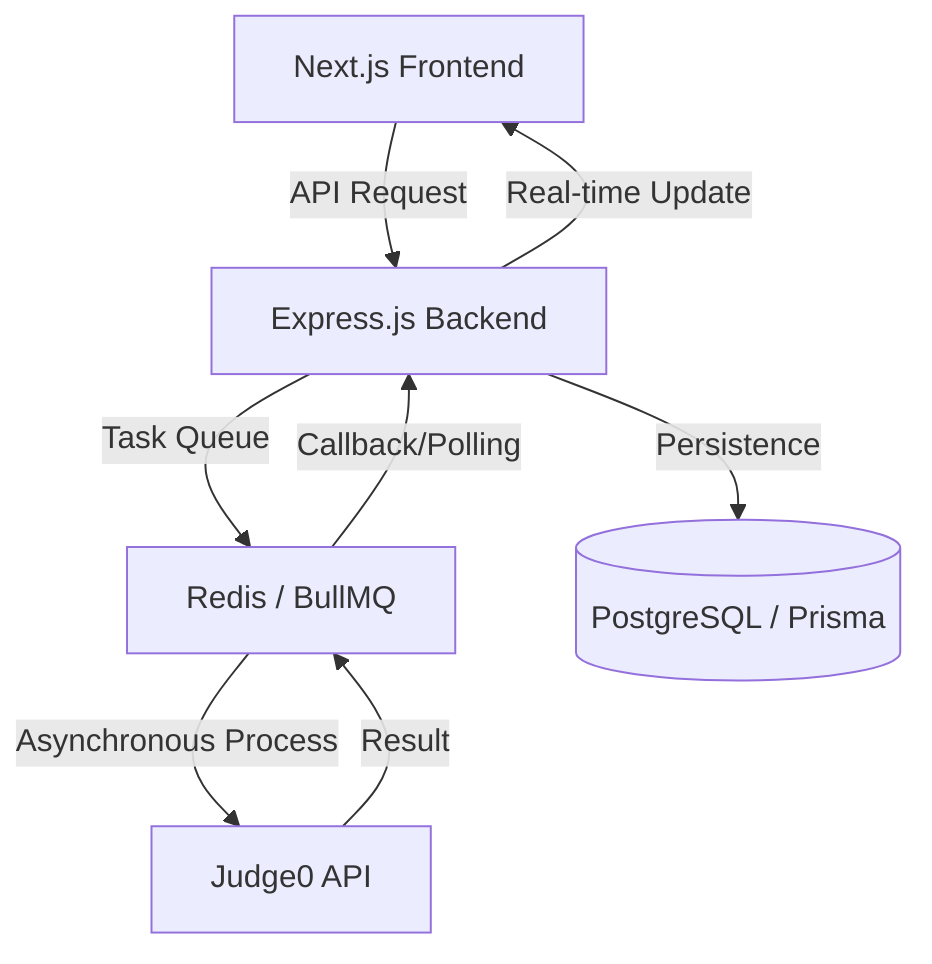

# VintiCode 🚀

### _The Ultimate High-Performance Coding Platform_

**VintiCode** is a premium, open-source Online Judge platform designed for developers to practice algorithmic challenges. Built with a focus on engineering excellence, it showcases a scalable, asynchronous architecture capable of handling high-concurrency code submissions with precision and speed.

---

## 💼 For Recruiters & Engineering Managers

_A 1-minute summary of why this project matters._

**VintiCode** demonstrates the transition from a simple "LeetCode clone" to a professional full-stack application by solving complex problems like **secure, non-blocking code execution at scale**.

### Core Competencies Demonstrated:

- **Asynchronous System Design:** Implemented task queues using **BullMQ** and **Redis** to ensure compute-heavy tasks never block the user interface.
- **Architectural Excellence:** Refactored from a feature-based structure to a modular **Controller/Router pattern** for enterprise-grade maintainability.
- **Security-First Approach:** Abstracted code execution to a secure **Judge0** sandbox, effectively mitigating Remote Code Execution (RCE) risks.
- **Premium UX/UI:** Integrated **Monaco Editor** and high-fidelity animations (**GSAP/Framer Motion**) to deliver a world-class developer experience.

---

## ✨ Key Features

- **Interactive Code Editor:** Monaco Editor integration with multi-language support.
- **Real-time Submission System:** Powered by BullMQ and Redis for efficient, asynchronous task processing.
- **Performance Tracking:** Comprehensive dashboard with difficulty-wise problem tracking and submission history.
- **Premium UI/UX:** Built with Next.js 15, HeroUI, and Framer Motion for a fluid, glassmorphic design.
- **Scalable Backend:** Express.js architecture with organized Controller/Route patterns and Prisma ORM.

---

## 🏗️ System Architecture & Data Flow

VintiCode uses a decoupled, event-driven architecture to handle submissions without latency.



### Technical Deep-Dive:

1. **The Submission Lifecycle:** When a user submits code, it is immediately persisted in **PostgreSQL** with a `queued` status. A job is then pushed to **Redis**.
2. **Background Processing:** A dedicated worker picks up the job, orchestrates communication with the **Judge0 API**, and updates the status once judging is complete.
3. **Frontend Reactivity:** The client-side application polls the backend, which retrieves the near-instant state from Redis, providing a smooth user experience.

---

## 🛠️ Tech Stack

### Frontend & UI

- **Core:** Next.js 15+ (App Router), TypeScript, React 19
- **Design:** HeroUI, Radix UI, Tailwind CSS
- **Animations:** Framer Motion, GSAP
- **Editor:** @monaco-editor/react

### Backend & Infrastructure

- **Core:** Node.js, Express.js (Controller/Router Pattern)
- **Database:** PostgreSQL with Prisma ORM
- **Concurrency:** Redis & BullMQ
- **Sandbox:** Judge0 integration via RapidAPI

---

## 🚀 Getting Started

### Prerequisites

- Node.js (v18+)
- PostgreSQL & Redis
- RapidAPI Key (for Judge0)

### Installation & Setup

1. **Clone the repository:**

   ```bash
   git clone https://github.com/yatinsingh2007/VintiCode.git
   cd VintiCode
   ```

2. **Backend Setup:**

   ```bash
   cd allgrow-backend
   npm install
   # Configure your .env (DATABASE_URL, REDIS_URL, JWT_SECRET, USER_1...USER_5)
   npx prisma generate && npx prisma migrate dev
   npm run dev
   ```

3. **Frontend Setup:**
   ```bash
   cd ../vinticode-frontend
   npm install
   # Configure your .env (NEXT_PUBLIC_BACKEND_URL)
   npm run dev
   ```

---

## 📂 Project Structure

```text
VintiCode/
├── allgrow-backend/       # Express.js API
│   ├── controllers/      # Business Logic (Auth, Dashboard, Submissions)
│   ├── routes/           # Route Definitions (Clean separation)
│   ├── prisma/           # Database Schema & Client
│   └── middleware/       # JWT Auth & Security
└── vinticode-frontend/    # Next.js Application
    ├── app/               # Next.js App Router (Pages & Layouts)
    ├── components/        # Reusable UI Components (CodeEditor, Orbit, etc.)
    └── section/           # High-level UI sections
```

---

## 📄 License

Distributed under the ISC License. See `LICENSE` for more information.

---

Built with ❤️ by [Yatin Singh](https://github.com/yatinsingh2007)
